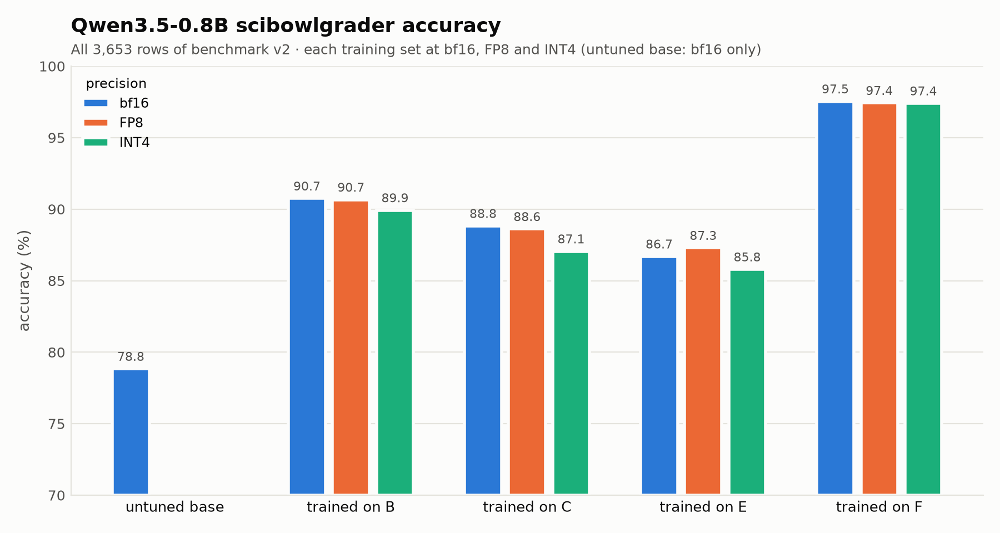
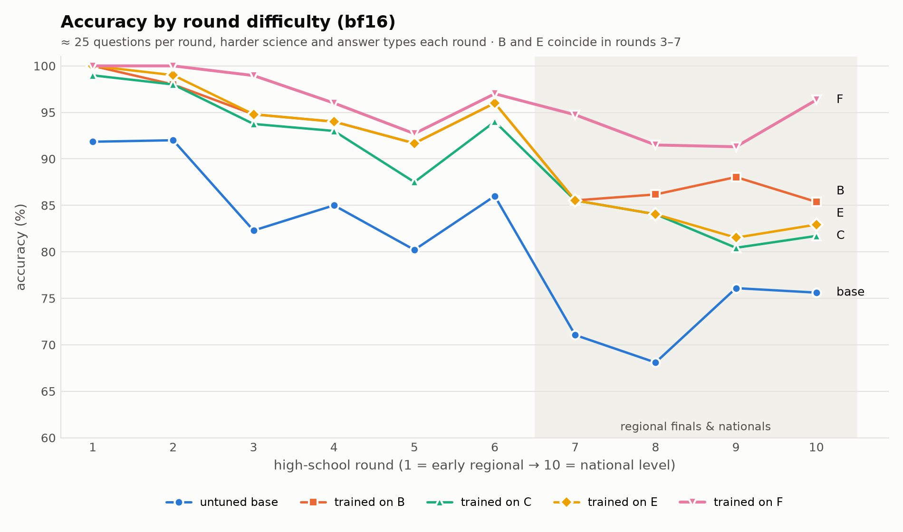
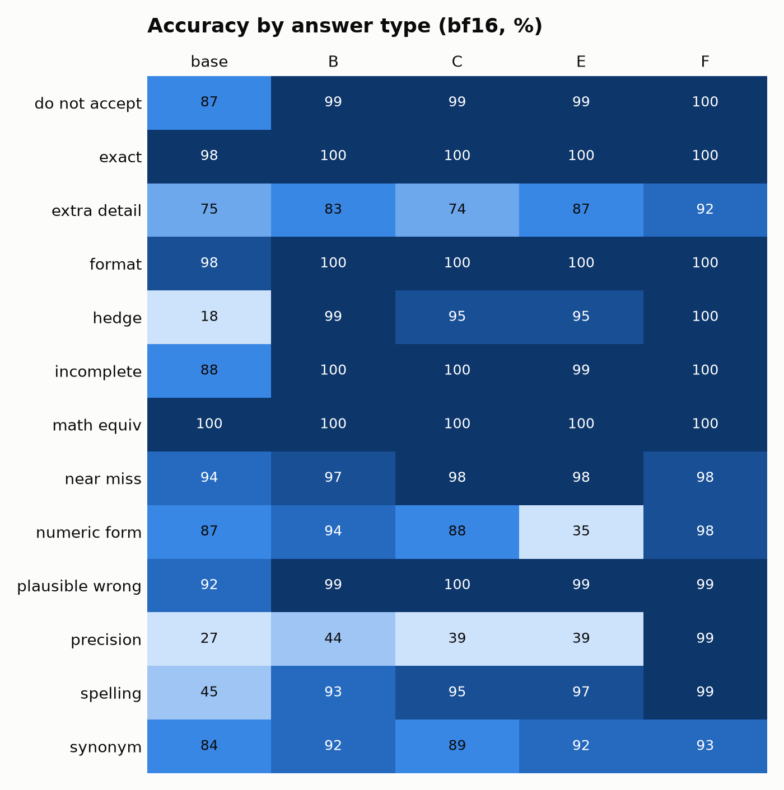
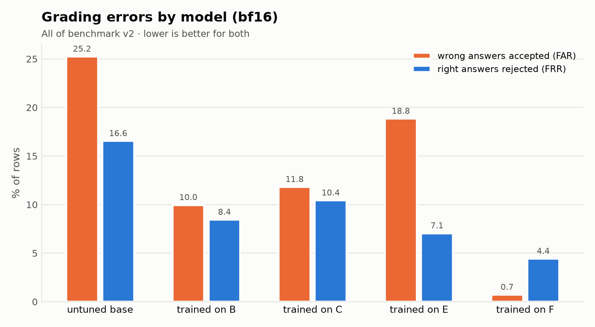
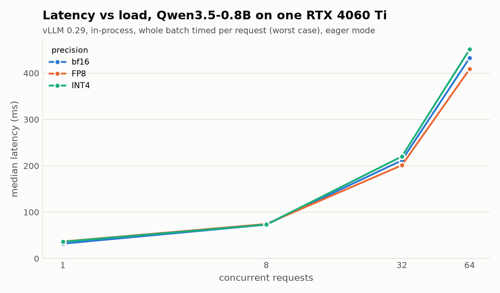

# SciBowlGrader

> SLM AI-based grader for Science Bowl short-answer responses.

SciBowlGrader is an experimental binary classifier that compares a contestant's
answer with the official answer and returns `CORRECT` or `INCORRECT`. It is
designed as a semantic fallback for cases that deterministic grading can miss,
such as synonyms ("perpendicular" and "normal"), equivalent numerical forms,
and compatible units.

The project was created for
[SciBowlSimulator](https://github.com/tshulin/SciBowlSimulator). Its longer-term
goal is a small model that can run locally in a browser through WebGPU.

## Highlights

- Fine-tuned from Qwen3.5-0.8B with LoRA.
- The best model was trained on dataset F.
- The F INT4 model reached **97.4% accuracy** on all 3,653 benchmark-v2 rows,
  only 0.1 percentage points below its bf16 counterpart.
- F INT4 was the only evaluated model to pass every finalist threshold for
  round accuracy, false accepts, false rejects, and near-miss accuracy.

## Current model

**[`scibowlgrader_qwen3_5_0_8b_model_f_int4`](models/scibowlgrader_qwen3_5_0_8b_model_f_int4/)**

| Property | Value |
|---|---|
| Base model | Qwen3.5-0.8B |
| Fine-tuning method | LoRA (r=16, α=32, 4 epochs, peak lr 1e-4) |
| Training set | F (19,931 rows) |
| Deployment precision | INT4 W4A16 (GPTQ) |
| Benchmark-v2 accuracy | 97.4% (all 3,653 rows) |
| False accepts / false rejects | 3.7% / 1.4% |
| Size | 943 MB |

All models are in [`models/`](models/), named
`scibowlgrader_qwen3_5_0_8b_model_<training set>_<form>`:

| Model | Form | Benchmark-v2 accuracy |
|---|---|---|
| [`..._f_int4`](models/scibowlgrader_qwen3_5_0_8b_model_f_int4/) | merged, INT4 W4A16 | **97.4%** (recommended) |
| [`..._f_fp8`](models/scibowlgrader_qwen3_5_0_8b_model_f_fp8/) | merged, FP8 (stored checkpoint) | 96.8% |
| [`..._f_bf16`](models/scibowlgrader_qwen3_5_0_8b_model_f_bf16/) | merged, bf16 | 97.5% |
| [`..._f_lora`](models/scibowlgrader_qwen3_5_0_8b_model_f_lora/) | LoRA adapter | 97.5% (merged in bf16) |
| [`..._e_lora`](models/scibowlgrader_qwen3_5_0_8b_model_e_lora/) | LoRA adapter | 86.7% |
| [`..._c_lora`](models/scibowlgrader_qwen3_5_0_8b_model_c_lora/) | LoRA adapter | 88.8% |
| [`..._b_lora`](models/scibowlgrader_qwen3_5_0_8b_model_b_lora/) | LoRA adapter | 90.7% |

The merged models store `model.safetensors` in 95 MiB pieces (GitHub's
per-file limit is 100 MB). Rebuild them once after cloning; the script checks
every file's sha256:

```bash
bash models/reassemble.sh
```

Then load a folder directly, for example
`vllm.LLM(model="models/scibowlgrader_qwen3_5_0_8b_model_f_int4")`. See
[`models/README.md`](models/README.md) for the prompt format and for loading
the LoRA adapters.

The FP8 model is a stored checkpoint (96.8%). Loading the bf16 model with
vLLM's `quantization="fp8"` instead scored 97.4%; the benchmark tables below
report that load-time FP8.

## Repository contents

| Path | Contents |
|---|---|
| [`training_data/`](training_data/) | Model-ready train and validation splits for datasets B–F |
| [`dataset/`](dataset/) | Generated examples, source questions, shards, and verification metadata |
| [`models/`](models/) | Every model: F in INT4, FP8, bf16 and as a LoRA adapter; LoRA adapters for B, C and E |
| [`graphics/`](graphics/) | Benchmark charts in PNG and SVG formats |

Training rows use a simple prompt/completion schema:

```json
{"prompt": "<question, official answer, and contestant answer>", "completion": "CORRECT"}
```

See each training set's `manifest.json` for provenance, row counts, label
balance, checksums, and split details.

## Benchmarks

All accuracy and error-rate values below are percentages. FAR is the
**false-accept rate** (wrong answers accepted); FRR is the **false-reject rate**
(right answers rejected).











Every chart is also available as an SVG in [`graphics/`](graphics/).

## Overall results

- `all v2`: accuracy across all 3,653 benchmark-v2 rows.
- `pair acc`: mean across the four pair files of the share of pairs for which
  both answers were graded correctly.
- `FAR` and `FRR`: calculated across all benchmark-v2 rows.

| model | curated_v1 | all v2 | types | pairs | rounds | pair acc | FAR | FRR |
|---|---|---|---|---|---|---|---|---|
| base bf16 | 89.6 | 78.8 | 76.5 | 81.8 | 81.3 | 64.3 | 25.2 | 16.6 |
| B bf16 | 96.0 | 90.7 | 92.2 | 85.0 | 92.3 | 70.0 | 10.0 | 8.4 |
| B fp8 | 96.0 | 90.7 | 92.1 | 84.9 | 92.3 | 69.8 | 10.5 | 8.0 |
| B int4 | 94.3 | 89.9 | 91.5 | 83.7 | 91.8 | 67.4 | 11.5 | 8.5 |
| C bf16 | 96.6 | 88.8 | 90.7 | 82.5 | 90.0 | 65.2 | 11.8 | 10.4 |
| C fp8 | 96.3 | 88.6 | 90.2 | 83.7 | 89.2 | 67.4 | 10.9 | 11.9 |
| C int4 | 94.6 | 87.1 | 89.7 | 80.3 | 87.0 | 60.3 | 10.8 | 15.4 |
| E bf16 | 96.6 | 86.7 | 88.2 | 77.2 | 91.3 | 55.1 | 18.8 | 7.1 |
| E fp8 | 96.0 | 87.3 | 89.0 | 79.3 | 90.3 | 59.2 | 16.9 | 7.9 |
| E int4 | 95.0 | 85.8 | 86.7 | 77.8 | 90.5 | 56.5 | 21.7 | 5.7 |
| F bf16 | 98.0 | 97.5 | 98.3 | 97.5 | 95.9 | 94.8 | 0.7 | 4.4 |
| F fp8 | 97.3 | 97.4 | 98.1 | 97.5 | 95.9 | 94.8 | 0.5 | 4.9 |
| F int4 | 95.0 | 97.4 | 97.8 | 96.6 | 97.3 | 93.2 | 3.7 | 1.4 |

## Detailed results

### Accuracy by round (%)

Rounds 1–2 early regional, 3–4 regional, 5–6 regional elimination, 7–8 regional final (AP level),
9–10 national level. Rows per round: 98, 100, 96, 100, 96, 100, 76, 94, 92, 82.

| model | 1 | 2 | 3 | 4 | 5 | 6 | 7 | 8 | 9 | 10 |
|---|---|---|---|---|---|---|---|---|---|---|
| base bf16 | 91.8 | 92.0 | 82.3 | 85.0 | 80.2 | 86.0 | 71.0 | 68.1 | 76.1 | 75.6 |
| B bf16 | 100.0 | 98.0 | 94.8 | 94.0 | 91.7 | 96.0 | 85.5 | 86.2 | 88.0 | 85.4 |
| B fp8 | 100.0 | 97.0 | 93.8 | 93.0 | 93.8 | 97.0 | 82.9 | 86.2 | 89.1 | 86.6 |
| B int4 | 100.0 | 98.0 | 94.8 | 92.0 | 92.7 | 96.0 | 86.8 | 84.0 | 88.0 | 81.7 |
| C bf16 | 99.0 | 98.0 | 93.8 | 93.0 | 87.5 | 94.0 | 85.5 | 84.0 | 80.4 | 81.7 |
| C fp8 | 99.0 | 97.0 | 92.7 | 92.0 | 87.5 | 92.0 | 85.5 | 80.8 | 79.3 | 82.9 |
| C int4 | 100.0 | 96.0 | 91.7 | 93.0 | 84.4 | 86.0 | 77.6 | 81.9 | 76.1 | 79.3 |
| E bf16 | 100.0 | 99.0 | 94.8 | 94.0 | 91.7 | 96.0 | 85.5 | 84.0 | 81.5 | 82.9 |
| E fp8 | 100.0 | 96.0 | 92.7 | 93.0 | 89.6 | 94.0 | 81.6 | 85.1 | 83.7 | 82.9 |
| E int4 | 99.0 | 99.0 | 91.7 | 94.0 | 89.6 | 94.0 | 84.2 | 85.1 | 84.8 | 79.3 |
| F bf16 | 100.0 | 100.0 | 99.0 | 96.0 | 92.7 | 97.0 | 94.7 | 91.5 | 91.3 | 96.3 |
| F fp8 | 100.0 | 100.0 | 96.9 | 96.0 | 92.7 | 97.0 | 93.4 | 93.6 | 92.4 | 96.3 |
| F int4 | 100.0 | 100.0 | 99.0 | 98.0 | 95.8 | 99.0 | 97.4 | 92.5 | 96.7 | 93.9 |

### Accuracy by answer type and pair file (%)

| file | n | base bf16 | B bf16 | B fp8 | B int4 | C bf16 | C fp8 | C int4 | E bf16 | E fp8 | E int4 | F bf16 | F fp8 | F int4 |
|---|---|---|---|---|---|---|---|---|---|---|---|---|---|---|
| do_not_accept | 150 | 86.7 | 98.7 | 98.0 | 96.7 | 99.3 | 100.0 | 100.0 | 99.3 | 100.0 | 98.0 | 100.0 | 100.0 | 96.0 |
| exact | 125 | 98.4 | 100.0 | 99.2 | 100.0 | 100.0 | 100.0 | 100.0 | 100.0 | 100.0 | 100.0 | 100.0 | 99.2 | 100.0 |
| exact · precision | 198 | 62.6 | 67.2 | 67.2 | 64.7 | 63.1 | 67.7 | 66.2 | 64.7 | 67.7 | 63.6 | 100.0 | 100.0 | 96.0 |
| extra_detail | 150 | 74.7 | 82.7 | 84.7 | 86.7 | 74.0 | 69.3 | 70.7 | 86.7 | 84.0 | 88.0 | 92.0 | 90.0 | 98.7 |
| extra_wrong_detail · plausible_wrong | 174 | 85.6 | 81.0 | 82.2 | 79.9 | 82.8 | 80.5 | 73.6 | 86.2 | 86.8 | 87.9 | 94.2 | 94.2 | 97.7 |
| format | 148 | 98.0 | 100.0 | 100.0 | 99.3 | 100.0 | 99.3 | 99.3 | 100.0 | 99.3 | 100.0 | 100.0 | 99.3 | 100.0 |
| hedge | 150 | 18.0 | 98.7 | 97.3 | 98.0 | 95.3 | 95.3 | 93.3 | 95.3 | 94.0 | 83.3 | 100.0 | 100.0 | 98.0 |
| incomplete | 150 | 88.0 | 100.0 | 99.3 | 98.7 | 100.0 | 100.0 | 100.0 | 99.3 | 100.0 | 98.7 | 100.0 | 100.0 | 98.7 |
| math_equiv | 148 | 100.0 | 100.0 | 100.0 | 100.0 | 100.0 | 100.0 | 99.3 | 100.0 | 100.0 | 100.0 | 100.0 | 100.0 | 100.0 |
| math_equiv · numeric_form | 194 | 94.3 | 97.9 | 97.4 | 97.4 | 93.8 | 94.8 | 95.9 | 65.5 | 69.6 | 65.0 | 99.0 | 99.0 | 99.0 |
| near_miss | 200 | 93.5 | 97.0 | 97.0 | 96.0 | 98.0 | 98.0 | 98.0 | 98.5 | 98.5 | 96.5 | 97.5 | 97.5 | 93.5 |
| numeric_form | 142 | 87.3 | 93.7 | 94.4 | 93.7 | 88.0 | 88.7 | 91.5 | 35.2 | 47.2 | 34.5 | 97.9 | 98.6 | 95.8 |
| plausible_wrong | 150 | 92.0 | 98.7 | 98.0 | 98.7 | 100.0 | 100.0 | 99.3 | 99.3 | 100.0 | 98.7 | 99.3 | 99.3 | 97.3 |
| precision | 148 | 27.0 | 43.9 | 41.9 | 38.5 | 39.2 | 39.2 | 42.6 | 39.2 | 43.2 | 34.5 | 99.3 | 100.0 | 97.3 |
| spelling | 150 | 45.3 | 93.3 | 93.3 | 91.3 | 95.3 | 93.3 | 90.7 | 96.7 | 95.3 | 96.7 | 99.3 | 99.3 | 100.0 |
| synonym | 148 | 84.5 | 91.9 | 93.9 | 91.2 | 88.5 | 88.5 | 79.7 | 91.9 | 91.2 | 93.9 | 93.2 | 92.6 | 97.3 |
| synonym · near_miss | 194 | 85.6 | 93.8 | 92.8 | 92.8 | 90.7 | 91.8 | 85.0 | 93.8 | 94.3 | 95.9 | 96.4 | 96.4 | 93.8 |

### Finalist selection

To pass, a model must achieve at least 95% accuracy across the ten rounds, no
more than 5% FAR, no more than 5% FRR, and at least 90% accuracy on `near_miss`.
Passing models are then ranked by their accuracy on rounds 7–10.

| model | rounds acc | rounds FAR | rounds FRR | near_miss | passes | rounds 7–10 |
|---|---|---|---|---|---|---|
| base bf16 | 81.3 | 17.1 | 20.3 | 93.5 | no | 72.7 |
| B bf16 | 92.3 | 4.5 | 10.9 | 97.0 | no | 86.3 |
| B fp8 | 92.3 | 4.7 | 10.7 | 97.0 | no | 86.3 |
| B int4 | 91.8 | 5.4 | 11.1 | 96.0 | no | 85.2 |
| C bf16 | 90.0 | 5.4 | 14.6 | 98.0 | no | 82.8 |
| C fp8 | 89.2 | 4.7 | 16.9 | 98.0 | no | 82.0 |
| C int4 | 87.0 | 4.7 | 21.2 | 98.0 | no | 78.8 |
| E bf16 | 91.3 | 7.1 | 10.3 | 98.5 | no | 83.4 |
| E fp8 | 90.3 | 7.3 | 12.2 | 98.5 | no | 83.4 |
| E int4 | 90.5 | 10.5 | 8.6 | 96.5 | no | 83.4 |
| F bf16 | 95.9 | 0.6 | 7.5 | 97.5 | no | 93.3 |
| F fp8 | 95.9 | 0.2 | 7.9 | 97.5 | no | 93.9 |
| F int4 | 97.3 | 2.8 | 2.6 | 93.5 | **yes** | 95.1 |

### Latency (median ms)

Measured on an RTX 4060 Ti 16 GB with vLLM 0.29 using 500 `curated_v1`
prompts. Requests ran in-process, with the entire batch timed per request.

| precision | 1 | 8 | 32 | 64 | peak req/s |
|---|---|---|---|---|---|
| bf16 | 32 | 73 | 212 | 433 | 150 |
| fp8 | 37 | 74 | 201 | 409 | 157 |
| int4 | 36 | 73 | 220 | 451 | 144 |
| bf16 (CUDA graphs) | 26 | 62 | 193 | 357 | 171 |
